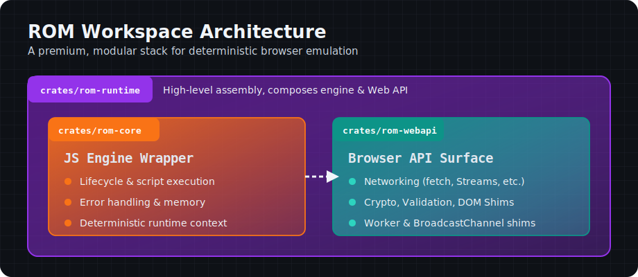
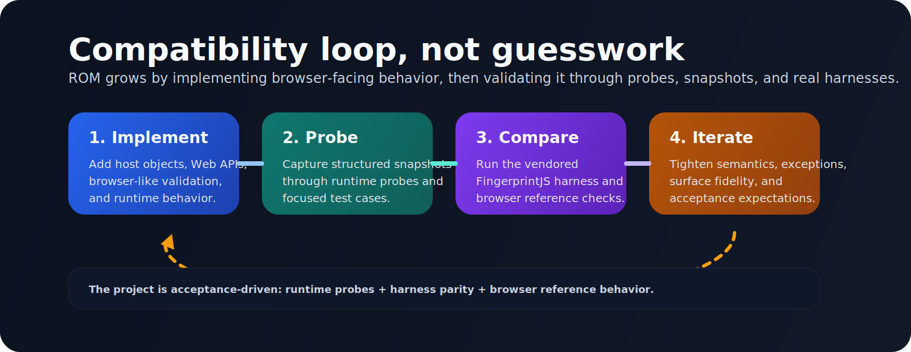

<p align="center">
  
</p>

# ROM

<p align="center">
  
</p>

<p align="center">
  <strong>A browser-like runtime in Rust, built without Chromium.</strong><br/>
  ROM composes an embedded JavaScript engine, browser-facing host objects, and a compatibility-driven runtime
  for deterministic web automation, surface emulation, and browser API research.
</p>

<p align="center">
  <a href="https://github.com/Rxflex/rom/actions/workflows/ci.yml"></a>
  <a href="https://github.com/Rxflex/rom/stargazers"></a>
  <a href="https://github.com/Rxflex/rom/network/members"></a>
  <a href="https://github.com/Rxflex/rom/issues"></a>
  <a href="https://github.com/Rxflex/rom/blob/main/LICENSE"></a>
</p>

<p align="center">
  
  
  
  
</p>

## Why ROM

Most browser automation stacks start by shipping a full browser.
ROM starts from the opposite direction:

- keep the runtime small and programmable
- emulate the browser surface incrementally
- validate compatibility against browser-facing probes and real harnesses
- stay transparent enough that the runtime can be inspected, extended, and reasoned about

The result is a native Rust workspace that aims to feel browser-like at the API layer without inheriting the operational weight of Chromium.

## What ROM Is

- A Rust workspace with a lightweight embedded JavaScript engine.
- A growing browser API compatibility layer.
- A runtime designed around deterministic probes, snapshots, and acceptance harnesses.
- A Rust core with JS and Python bindings that can use either native extensions or the CLI bridge.

## What ROM Is Not

- Not a full browser engine.
- Not a layout engine or Chromium replacement.
- Not production-complete yet.
- Not claiming full Web Platform coverage.

## Highlights

| Area | Current State |
| --- | --- |
| Runtime core | Embedded JavaScript runtime lifecycle, script execution, error handling |
| Web platform | `fetch`, streams, blobs, files, URLs, parser, workers, messaging, cookies, SSE, WebSocket |
| Crypto | `digest`, HMAC, `AES-CTR`, `AES-CBC`, `AES-GCM`, `AES-KW`, `PBKDF2`, `HKDF` |
| Validation | Browser-like parameter validation, JWK validation, key usage validation, import/export edge handling |
| Compatibility | `surface_snapshot()`, `fingerprint_probe()`, vendored FingerprintJS harness, browser reference runner |
| Media and device surface | permissions, media devices, plugins, mime types, viewport, orientation, media queries |

## Browser Surface Snapshot

### Networking and data

- `fetch`
- `Headers`, `Request`, `Response`
- `ReadableStream`-based `Request.body` and `Response.body`
- redirect modes: `follow`, `error`, `manual`
- CORS response gating and preflight validation
- `AbortController`, `AbortSignal`
- `Blob`, `File`, `FormData`
- `URL`, `URLSearchParams`, `URLPattern`
- `DOMParser`
- `blob:` object URLs
- cookies via `document.cookie`, `Cookie`, and `Set-Cookie`

### Realtime and messaging

- `MessageEvent`, `MessagePort`, `MessageChannel`
- `BroadcastChannel`
- `Worker` with `Blob` URL scripts, `postMessage()`, and `importScripts()`
- `EventSource` with `retry`, reconnect, custom events, `lastEventId`, and `close()`
- `WebSocket` with `ws:` and `wss:`, text and binary frames, `Blob` payloads, and close events

### Crypto

- `crypto.getRandomValues()`
- `crypto.randomUUID()`
- `crypto.subtle.digest()` for `SHA-1`, `SHA-256`, `SHA-384`, `SHA-512`
- HMAC `generateKey()`, `importKey()`, `exportKey()`, `sign()`, `verify()`
- `AES-CTR`, `AES-CBC`, `AES-GCM` `generateKey()`, `importKey()`, `exportKey()`, `encrypt()`, `decrypt()`
- `AES-GCM` 128/192/256-bit keys and tag lengths `96..128`
- `AES-KW` wrapping flows
- `PBKDF2` and `HKDF` for `importKey()`, `deriveBits()`, `deriveKey()`
- browser-like secret-key validation for length, usages, params, JWK content, import/export, wrap/unwrap payloads, and derive semantics

### DOM and compatibility surface

- `structuredClone()`
- `FileReader`
- `navigator.permissions.query()`
- `navigator.mediaDevices`
- `navigator.userAgentData`
- `navigator.plugins`, `navigator.mimeTypes`, `navigator.pdfViewerEnabled`
- viewport globals, `visualViewport`, `screen.orientation`, `matchMedia()`
- `MutationObserver`, `ResizeObserver`, `IntersectionObserver`
- DOM event propagation with capture, bubble, `once`, propagation stopping, and `composedPath()`

## Architecture

<p align="center">
  
</p>

The workspace is intentionally split into three layers:

- `crates/rom-core`
  Raw embedded JavaScript engine wrapper.
- `crates/rom-webapi`
  Browser API bootstrap and compatibility shims.
- `crates/rom-runtime`
  High-level environment assembly that composes engine and Web API behavior.

This separation keeps the core small, the web surface modular, and the runtime acceptance-focused.

## Quick Start

### Build

```bash
cargo build
```

### Run the full Rust test suite

```bash
cargo test
```

### Use the CLI bridge directly

```bash
echo "{\"command\":\"surface-snapshot\"}" | cargo run -p rom-runtime --bin rom_bridge
```

### Use the Node.js wrapper

```js
import { RomRuntime, hasNativeBinding } from "./bindings/gom-node/src/index.js";

const runtime = new RomRuntime({ href: "https://example.test/" });
const href = await runtime.evalAsync("(async () => location.href)()");
console.log("native binding:", hasNativeBinding());
console.log(href);
```

Optional native build:

```bash
cd bindings/gom-node
npm run build:native
```

### Use the Python wrapper

```python
import sys
sys.path.insert(0, "bindings/gom-python/src")

from rom import RomRuntime, has_native_binding

runtime = RomRuntime({"href": "https://example.test/"})
print("native binding:", has_native_binding())
print(runtime.eval_async("(async () => location.href)()"))
```

Optional native build:

```bash
python -m pip install maturin
python -m maturin develop --manifest-path bindings/gom-python/Cargo.toml
```

### Run the browser reference harness

```bash
npm install
npx playwright install chromium
npm run fingerprintjs:browser-reference
```

## Compatibility Strategy

ROM does not treat compatibility as a vague goal.
It already has two concrete acceptance layers:

- internal structured probes via `RomRuntime::surface_snapshot()` and `RomRuntime::fingerprint_probe()`
- a vendored FingerprintJS harness via `RomRuntime::run_fingerprintjs_harness()`

That gives the project a measurable loop instead of an anecdotal one.

## Roadmap Direction

- push deeper Web Platform coverage without losing runtime clarity
- improve long-lived networking and worker fidelity
- keep tightening browser-like exception and validation behavior
- expand reference-driven compatibility checks
- strengthen the native JS/Python binding story on top of the shared bridge protocol

## Repository Map

```text
.
├── bindings/
│   ├── gom-node
│   └── gom-python
├── crates/
│   ├── rom-core
│   ├── rom-runtime
│   └── rom-webapi
├── docs/
├── fixtures/
└── tools/
```

## Open Source Notes

ROM is experimental, but it is being built in the open with a clear technical direction.
If you care about browser emulation, deterministic runtime design, anti-bot research tooling, or compatibility-first Web API implementation, this repo is meant to be inspectable and hackable.

Issues, design discussion, and focused contributions are welcome.
Start with [CONTRIBUTING.md](./CONTRIBUTING.md) and use [SECURITY.md](./SECURITY.md) for vulnerability reports.

## License

MIT. See [LICENSE](./LICENSE).
